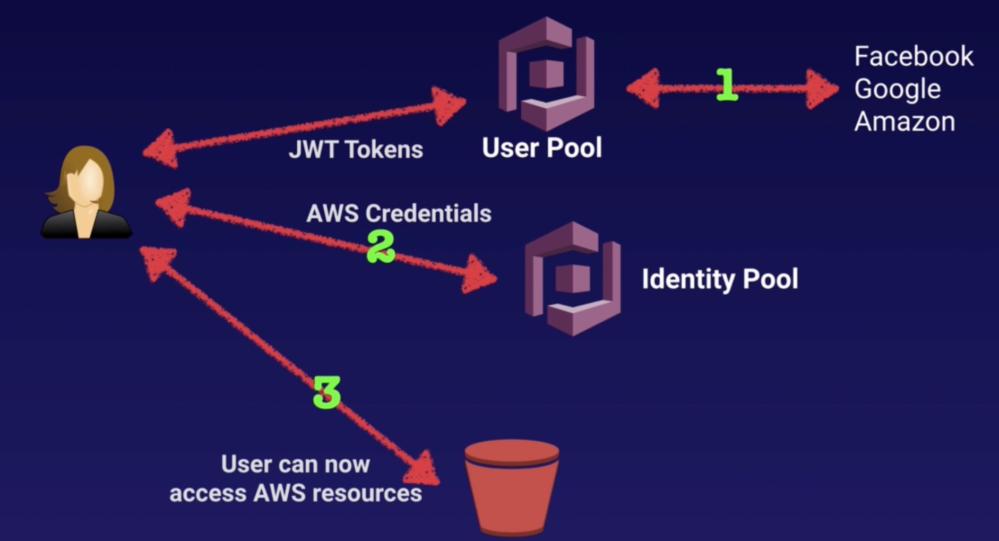

> This note was taken while learning AWS on <a href='https://www.udemy.com/course/aws-certified-solutions-architect-associate/' target='__blank'>Udemy</a>.

## SQS (Simple Queue Service)

- a way of storing messages in a queue
- **decoupling** infrastructure
- **pull-based** - need to have EC2 instance pulling messages out of queue
- give you access to a message queue that can be used to store messages while waiting for a computer to process them
- a distributed queue system that enables web service applications to quickly and reliably queue messages that one component in the application generates to be consumed by another component
- Messages
  - 256KB in size
  - can be kept in queue from 1min ~ 14days
  - default retention period : 4days

### Visibility timeout

- the amount of time that message is invisible in SQS queue after a reader picks up that message
- maximum = 12 hours
- if job is not processed within that time, message will become visible again and another reader will process it
- this could result in the same message being delivered twice
- So, if you're getting same message being delivered twice,
  - it's because your **visibility timeout is not long enough**

### Queue

a temporary repository for messages awaiting processing

- Standard queues (default)
  - nearly-unlimited number of transactions per second
  - more than one copy of a message might be delivered out of order
  - 메세지가 여러번, 순서에 상관없이 보내져도 괜찮을때. 대신 빠름.
- FIFO queues
  - exactly-once processing
  - the order in which messages are sent and received is strictly preserved
  - 메세지를 딱 한번 순서에 맞춰 보내야 할때. Standard보다 느림.

### Polling

poll = check the status

- short polling (default)
  - return immediately (even if message queue being polled is empty)
- long polling
  - retrieve messages from SQS queues
  - doesn't return a response until a message arrives in the message queue, or long poll times out
  - reduce cost (return할때마다 비용이 드니까)

## SWF (Simple Work Flow)

- a state tracker and **task coordinator** in the cloud
- e.g. if your app's steps take more than 500 milliseconds to complete, you need to track the state of processing, and you need to recover or retry if a task fails, SWF can help you.
- used when it involves any kind of **human** interaction or manual process
- SWF Actors
  - Workflow starters
  - Deciders
  - Activity workers

### SQS vs SWF

- **SQS**
  - retention period of up to 14 days
  - message-oriented API
  - need to handle duplicated messages and may also need to ensure that a message is processed only once
  - need to implement own application-level tracking
- **SWF**
  - workflow executions can last up to 1 year
  - task-oriented API
  - task is assigned only once and never duplicated
  - keeps track of all the tasks and events in an application

## SNS (Simple Notification Service)

- set up, operate, send notifications from the cloud
- publish messages from an application and immediately deliver them to subscribers or other applications
- push notifications to mobile devices / SMS text / email to SQS queues / any HTTP endpoint
- allow you to group multiple recipients using topics
- all messages are stored redundantly across multiple AZ
- instantaneous, **push-based** delivery (no polling)
- SNS vs SQS
  - Both - messaging services in AWS
  - SNS - Push / SQS - Polls(Pulls)

## Elastic Transcoder

- media transcoder in the cloud
- convert media files from their original source format in to different formats that will play on other devices
- provide transcoding presets for popular output formats

## API Gateway

- can publish, maintain, monitor, secure APIs at any scale
- low cost, scales automatically
- enable API caching to increase performance
  - cache your endpoint's response
  - reduce the number of calls made to your endpoint 
  - improve the latency of requests to your API
- same-origin policy
  - web browser permits scripts contained in a first web page to access data in a second web page, but only if both web pages have the same origin
  - done to prevent Cross-site Scripting(XSS) attacks
- CORS (Cross-Origin Resource Sharing)
  - one way the server at the other end can relax the same-origin policy
  - enforced by the client (=browser)
  - allow restricted resources(e.g. fonts) on a web page to be requested from another domain outside the domain from which the first resource was served
  - when you get an error "**Origin policy cannot be read at the remote resource**" or if you're using Javascript/AJAX that uses multiple domains,
      - enable CORS on API Gateway

## Kinesis

- a platform to send your streaming data to.
- easily load and analyze streaming data
- **Streaming data** : is generated continuously by thousands of data sources, which typically send in the data records **simultaneously**, and in small sizes
  - e.g. stock prices, social network data, ...

### Types of Kinesis

- Kinesis Streams
  - consist of **shards**
  - data is stored for 24 hrs
- Kinesis Firehose
  - no persistent storage - data has to be analyzed as it comes in
  - 데이터 들어오면 바로 lambda로 코드 실행하고 안전한 다른곳으로 output
  - when you want to analyze automatically using lambda
- Kinesis Analytics
  - when you want to analyze data inside Kinesis

## Web Identity Federation & Cognito

- Web Identity Federation
  - give users access to AWS resources after they have successfully authenticated with a web-based identity provider (e.g. Google. Facebook, Amazon)
  - user receives an authentication token from Web ID provider, which they can trade for temporary AWS security credentials
- Amazon Cognito
  - provide Web Identity Federation with the following features
      - sign-up, sign-in to your apps
      - access for guest users
      - acts as an Identity Broker between identity provider and AWS
  - **User pools**
      - user directories used to manage sign-up, sign-in functionality
      - users can sign-in directly to User pool
      - successful authentication generates JWT
      - all about your actual users (e.g. email address, password, ...)
  - **Identity pools**
      - provide temporary AWS credentials to access AWS services
      - all about authorization of access to AWS resources (e.g. actual granting of authentication)

