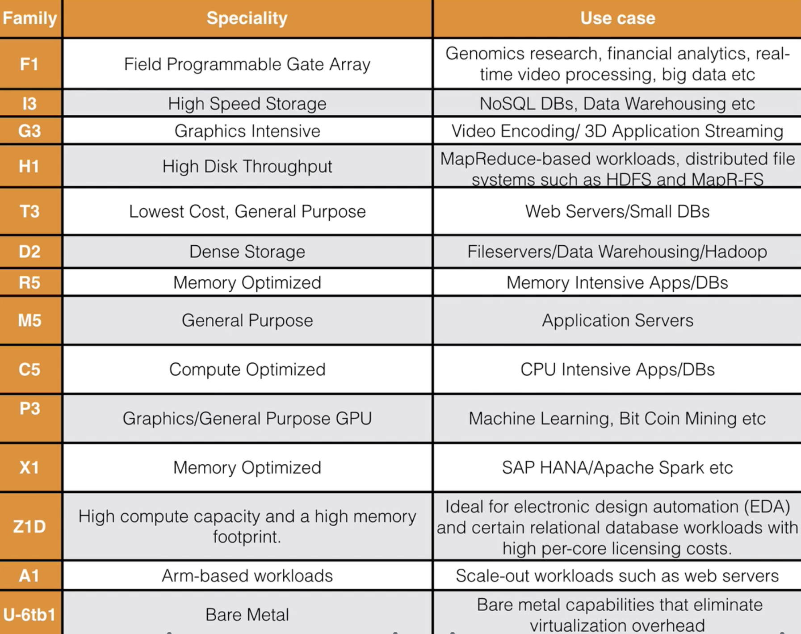
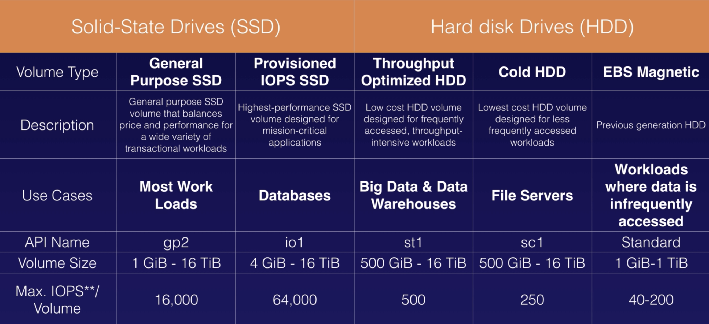

> This note was taken while learning AWS on <a href='https://www.udemy.com/course/aws-certified-solutions-architect-associate/' target='__blank'>Udemy</a>.

### EC2 = Elastic Compute Cloud

- virtual servers in the cloud
- a web service
  - provide resizable **compute** capacity in the cloud
  - reduce time required to obtain/boot new server instances to mins
  - allow you to quickly scale capacity as your computing requirements change
- S3 = storage in the cloud / EC2 = compute in the cloud

## Pricing models

### On-Demand

- pay a fixed rate by hour(or second)
- no commitment, no upfront payment

### Reserved

- provide capacity reservation
- with steady state/predictable usage
- offer significant discount on hourly charge
- 1yr or 3yr contract terms

- **Standard** : the more pay upfront, the longer the contract, the greater the discount.
- **Convertible** : allow you to change between different instance types
- **Scheduled** : available to launch within the time windows you reserve

### Spot

- bid whatever price for Amazon's excess capacity
- depend on Amazon's supply&demand (like stock market)
- set the price you want to bid
  - if it hits that price - have your instance
  - if it goes above price - lose your instance
- for applications that have flexible start/end times
- if terminated by EC2, no charged for a partial hour of usage
- but if you terminate by yourself, you will be charged for partial.

### Dedicated Hosts

- physical EC2 server dedicated for your use
- for regulatory requirements
- great for licensing
- can be purchased on-demand/reservation

## Instance Types

- Associate 시험에선 그닥 중요X (Professional 시험에서 중요함)
- 알파벳뒤의 숫자들은 계속 바뀌기 때문에 신경쓰지말것

### Mnemonic

- **F** : for FPGA
- **I** : for IOPS
- **G** : Graphics
- **H** : High Disk Throughput
- **T** : Cheap general purpose (think T2 Micro)
- **D** : for Density
- **R** : for RAM
- **M** : Main choice for general purpose apps
- **C** : for Compute
- **P** : Graphics (think Pics)
- **X** : Extreme memory
- **Z** : Extreme memory AND CPU
- **A** : Arm-based workloads
- **U** : Bare Metal

## Launch EC2

- termination protection is turned off by default. Must turn it ON.
- on an EBS-backed instance,
  - default action is for root EBS volume to be deleted when the instance is terminated.
- EBS Root Volumes of default AMI's **can** be encrypted.

## Security Groups

- all inbound traffic is **blocked** by default.
  - if you allow traffic in, that traffic is automatically allowed back out again.
- all outbound traffic is **allowed**.
- change to security groups : take effect **immediately**.
- can have any number of EC2 instances within a security group.
- can have **multiple** security groups attached to EC2 instances.
- **stateful** : no need to change inbound/outbound ports (enabled automatically)
- cannot block specific IP address using security groups
  - use Network ACL(Access Control Lists) instead
- can specify allow rules, not deny rules

# EBS (Elastic Block Store)

- **virtual hard disk** in the cloud
- provide persistent block storage volumes with EC2
- each EBS volume is automatically replicated within AZ to protect you from component failure
- EBS always in the same AZ with EC2

### 5 types of EBS storage

- API name 외우기

## Volumes

- a durable, block-level storage device
- use EBS volumes as primary storage for data that requires frequent updates
- always be in same AZ as EC2 instance
- To move EC2 volume from one **AZ** to another
  - take a snapshot of it,
  - create an AMI from snapshot,
  - use AMI to launch EC2 instance in new AZ.
- To move EC2 volume from one **region** to another
  - take a snapshot of it,
  - create an AMI from snapshot,
  - copy AMI from one region to the other,
  - use copied AMI to launch new EC2 instance in new region.

## Snapshots

- point-in-time copy of **EBS volume**, save to **S3**
  - when you take snapshot, that's how volume existed at that particular point in time.
  - = a photograph of disk
- **incremental**(증분식) copies of data
  - only unique blocks that have changed since last snapshot are moved to S3.
  - 마지막 스냅샷 이후 변경된 블록만이 저장됨
- first snapshot - take some time to create 
- each snapshot contains all of the information that is needed to restore your data (from the moment when the snapshot was taken) to a new EBS volume.
- To create a snapshot for EBS volumes that serve as root devices, you should stop instance before taking snapshot.
  - can take a snapshot while instance is running as well.
- can create AMI(Amazon Machine Image)'s from snapshots
- can change EBS volume sizes on the fly, including changing size&storage type.

## EBS vs Instance Store

- Root device type
  - EBS
  - Instance store
- select AMI based on
  - Region
  - OS (Operating System)
  - Architecture (32bit or 64bit)
  - Launch Permissions
  - Storage for the Root Device/Root Device Volume : Instance Store / EBS Backed Volumes
- All AMIs are categorized as
  - backed by Amazon EBS
  - or backed by instance store

### EBS Volumes

- root device for an instance launched from AMI
- created from EBS snapshot
- can be stopped
  - you'll not lose data even if it's stopped
- ROOT volumes will be deleted on termination
  - can tell AWS to keep root device volume

### Instance Store Volumes

- created from a template stored in S3
- cannot be stopped
  - ephemeral storage
  - if underlying host fails and it's stopped, you'll lose all data
- ROOT volumes will be deleted on termination

> Both can be rebooted - will not lose data

## ENI vs EN vs EFA

### ENI (Elastic Network Interface)

- virtual network card
- for basic networking
- for when you need
  - separate management network to production network
  - separate logging network
  - at **low cost**
  - → use multiple ENIs for each network

### EN (Enhanced Networking)

- use single root I/O virtualization (SR-IOV)
- to provide high-performance networking capabilities on supported instance types
- can be enabled using
  - **ENA** (Elastic Network Adapter) : support network speeds up to **100 Gbps**
  - Intel 82599 **VF** (Virtual Function) interface : up to **10 Gbps** (used on older instances)
  - 시험에서 ENA, VF가 주어지면 주로 ENA를 선택하는 문제
- for when you need
  - speed between 10Gbps ~ 100Gbps
  - reliable, high throughput

### EFA (Elastic Fabric Adapter)

- a network device
- can attach to EC2 instance
- for when you need
  - to accelerate **HPC**(High Performance Computing) & **machine learning** applications
  - to do an **OS by-pass**

## Encrypted Volumes & Snapshots

- snapshots of encrypted volumes : encrypted automatically
- volumes restored from encrypted snapshots : encrypted automatically
- can share snapshots, only when they're unencrypted.
  - shared with other AWS accounts or made public
- can encrypt root device volumes when you create EC2 instance.
- but, if you didn't encrypt that time, (when you had unencrypted volumes)
- how to make it encrypted?
  - 1.create a snapshot of unencrypted root device volume
  - 2.create a copy of snapshot, and select encrypt option
  - 3.create an AMI from encrypted snapshot
  - 4.use that AMI to launch new encrypted instances

## CloudWatch

- a monitoring service to **monitor performance**. (like trainer in gym)
- can monitor applications that run on AWS.
- Standard monitoring = 5 minutes (by default)
- Detailed monitoring = 1 minutes
- can create CloudWatch alarms which trigger notifications.

## CloudTrail

- **monitors API calls** in AWS platform. (all about auditing. like CCTV camera)
- increase visibility into your user,resource activity
- by recording AWS management console actions & API calls.
- you can identify which users & accounts called AWS, the source IP address from which calls were made, and when calls occurred.

## AWS Command Line

- can interact with AWS from anywhere in the world just by using CLI(Command Line).
- you will need to set up access in IAM.

## IAM Roles with EC2

- roles are more secure than storing access key/secret access key on individual EC2 instances.
- easier to manage.
- can be assigned to EC2 instance after it's created using console & command line.
- universal - use them in any region.

# EFS (Elastic File System)

- a file storage service for EC2 instances.

- EBS vs EFS
  - EBS : can mount virtual disk to only one EC2 instance. (no more than 1)
  - EFS : can share among EC2 instance
- provide simple interface - can create, configure file systems quickly & easily.
- storage capacity is elastic - growing & shrinking automatically as you add and remove files
- great way to share files between different EC2 instances
- when you need - **distributed**, highly resilient storage for **Linux** instances & Linux-based applications

### < Exam tips >

- support **NFS**v4 (Network File System version 4) protocol
- only pay for the storage you use
  - no pre-provisioning required
- can scale up to petabytes
- can support thousands of concurrent NFS connections
- data is stored across multiple AZ's within a region
- read after write consistency

## FSx

- **FSx for Windows**
  - a managed Windows Server
  - runs **SMB**-based (Windows Server Message Block) file services
  - designed for Windows & Windows applications
  - when you need - **centralised** storage for Windows-based applications
- **FSx for Lustre**
  - designed specifically for fast processing of workloads
  - for machine learning, HPC(High Performance Computing), video processing, EDA(Electronic Design Automation)
  - can store data directly on S3
  - when you need - **high-speed**, high-capacity distributed storage

## EC2 Placement Groups

- only certain types of instances can be launched in a placement group.
  - Compute / Memory / Storage Optimized, GPU
- can't merge placement groups
- can move an existing instance into a placement group
  - before move instance, instance must be in the stopped state
  - can move/remove instance using CLI or SDK (console X)

### Clustered

- a group of instances within a same, single AZ
    - can't span multiple AZ
- for low network latency, high network throughput
- only certain instances allowed
- recommended homogenous instances within clustered placement groups.

### Spread

- a group of instances that are each placed on distinct underlying hardware
- protect from hardware failure
- for applications that have a small number of **critical** EC2 instances that should be kept separate from each other.

### Partitioned

- EC2 divide each group into logical segments called partitions.
- each partition within a placement group has its own set of racks
- each rack has its own network & power source
- no two partitions share same racks
  - allow you to isolate impact of hardware failure within your application

### < Spread vs Partitioned >

- both : can span multiple AZ, but should be in same region
- the number of EC2 instance
  - Spread : for **single** instance partition.
  - Partitioned : for **multiple** EC2 instances within a partition.

# WAF (Web Application Firewall)

- let you monitor HTTP/HTTPS requests that are forwarded to CloudFront, Application Load Balancer or API Gateway.
- let you control access to your content.
- can configure conditions
- how to block malicious IP addresses
  - use WAF
  - use Network ACLs