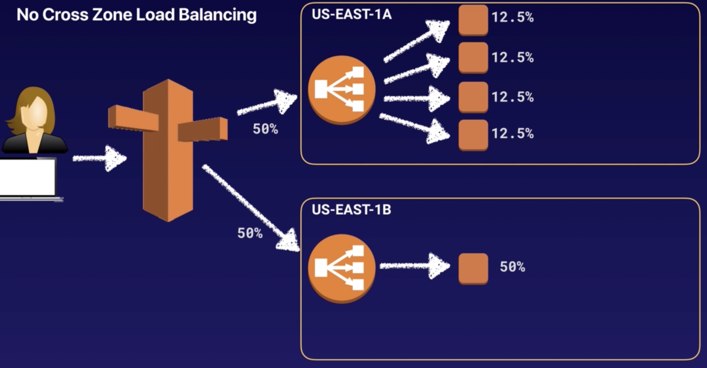
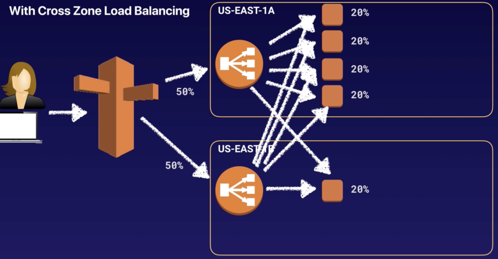
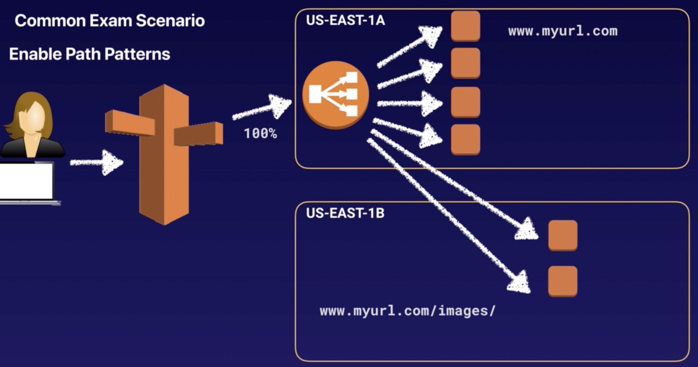

> This note was taken while learning AWS on <a href='https://www.udemy.com/course/aws-certified-solutions-architect-associate/' target='__blank'>Udemy</a>.

# Load Balancer

- physical or virtual device that balance the network load across multiple web servers
- if you need IPv4 address of your end user,
  - look for **X-Forwarded-For** header
- instances monitored by ELB are reported as - InService or OutofService
- have their own DNS name
  - you're never given an IP address

## Types of Load Balancer

- Application Load Balancer
  - best suited for HTTP,HTTPS traffic
- Network Load Balancer
  - best suited for TCP traffic
  - use for **extreme performance**
- Classic Load Balancer
  - legacy ELB(Elastic Load Balancer)
  - basic, cheaper one
  - if your application stops responding, ELB responds with 504 error
      - **504 error** = gateway has timed out

# Sticky Sessions

- enable users to stick to same EC2 instance
- useful if you're storing information locally to that instance
- all requests from user during session are sent to same instance
- when one of your EC2 instance not receiving any traffic,
  - disable sticky sessions!

# Cross-Zone Load Balancing

### Without Cross-Zone Load Balancing

ELB cannot send traffic to another AZ

### With Cross-Zone Load Balancing

ELB send traffic across 5 instances evenly (across multiple AZ)

### < Exam Scenario >

- when instance in AZ-1 getting all traffic, and instance in AZ-2 is not getting any traffic?
  - enable cross-zone load balancing
  - ELB in AZ-1 will distribute traffic to AZ-2 as well,
  - so all instances have even traffic

# Path Patterns

- direct traffic to different EC2 instances based on URL contained in the request
- path-based routing
  - create a listener with rules to forward requests based on URL path

- if enable path patterns,
  - Application Load Balancer (because it's reading URL path) in US-EAST-1A send traffic across two different AZ,
  - traffic for 'www.myurl.com/images' - direct to media EC2 instance in another AZ

# Auto Scaling

### 3 Components

- Groups
  - logical component where you put EC2 instances in
  - webserver/ application/ database group
- Configuration Templates
  - each group always use launch template or launch configuration
- Scaling Options
  - **maintain current** instance levels at all times
      - perform a periodic health check on running instances
      - when find an unhealthy instance, it terminates that instance and launch new one
  - scale **manually**
      - specify only the change in maximum, minimum, desired capacity of group
  - scale based on a **schedule**
      - useful when you know when to increase/decrease
  - scale based on **demand**
      - useful in response to changing conditions, when you don't know when conditions will change
  - use **predictive** scaling
      - predict based on your previous performance

# HA (High Availability) Architecture

- highly available = protect against failures
  - always design for failure
- scaling **out** : use auto scaling groups and add additional EC2 instances
- scaling **up** : increase the resources inside EC2 instances

### < exam scenario >

You have a website that requires a minimum of **6** instances and it must be highly available. You must also be able to tolerate the failure of 1 AZ. What is the ideal architecture for this while also being the most cost effective?

1. 2 AZs with 2 instances in each AZ. (X) - total instances 4 is less than 6
1. **3 AZs with 3 instances in each AZ.** (O) - even if 1 AZ fails, there are 6 instances still.
1. 1 AZ with 6 instances in each AZ. (X) - 1 AZ is not highly available
1. 3 AZs with 2 instances in each AZ. (X) - if 1 AZ fails, there are only 4 instances left which is less than 6.

# CloudFormation

- a way of completely scripting your cloud environment
- Quick Start : a bunch of CloudFormation templates already built by AWS Solutions Architects allowing you to create complex environments very quickly

# Elastic Beanstalk

- easy-to-use service for deploying and scaling web applications
- just upload your code and Elastic Beanstalk automatically handles the deployment and scales application