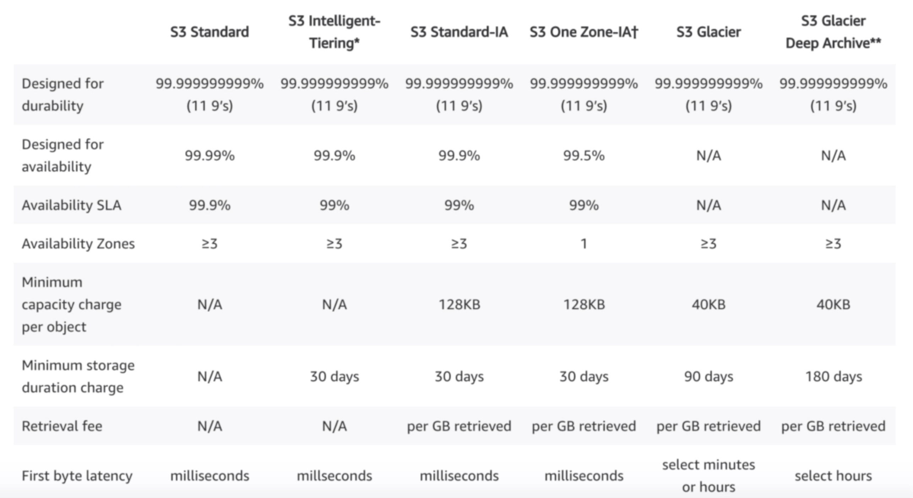

> This note was taken while learning AWS on <a href='https://www.udemy.com/course/aws-certified-solutions-architect-associate/' target='__blank'>Udemy</a>.

## Region

### Region

- separate **geographical** area. (physical location)
- consists of 2 or more Availability Zones.

### AZ (Availability Zone)

- one or more discrete data centers within an AWS region.
- to be isolated from failures.
- each with redundant power, networking and connectivity, housed in separate facilities.

### Edge location

- endpoints for AWS which are used for caching content.
- 시드니에 있는 유저가 뉴욕 서버에 있는 파일을 다운받을 경우 시드니 edge location에 캐싱해놓고, 다음에 시드니에 있는 다른 누군가가 다운받으려고 할때 뉴욕 서버에서 또 받아오는 게 아니라 시드니 edge location에서 파일을 받아옴

> 개체수 : Edge locations > AZ's > Regions

---

# IAM (Identity and Access Management)

allows you to **manage users and their level of access** to the AWS Console.

## Offers

- centralised control
- shared access
- granular(세분화된) permissions
- identity federation (incl. Active Directory, Facebook, LinkedIn, ...)
- provide temporary access for users/devices/services
- allow you to set up your own password rotation policy (주기적으로 비밀번호 변경하도록 하게함)
- integrate with many different AWS services
- support PCI DSS compliance (compliance framework)
- universal = **global** (doesn't apply to regions)
- new user has NO access

## Key terminology for IAM

1. Users : end users
2. Groups : a collection of users
3. Policies : made up of docs (in a JSON format). give permissions.
4. Roles : create roles and assign them to AWS resources.

---

# S3 (Simple Storage Service)

> provides secure, durable, highly-scalable object storage.

- **object-based** : allow to upload files
- not suitable to install an OS or a database on. (files only)
- storage size
  - individual objects : 0bytes ~ 5TB
  - by single PUT request : maximum 5GB
  - larger than 100MB : multipart uploads
- unlimited storage
- files are stored in **Buckets**.
  - maximum 100 buckets per account
- universal namespace : name must be unique globally
- receive **HTTP 200** code if file upload was successful.
- can turn on **MFA**(Multi-Factor Authentication) to delete
- consistency
  - Read after Write consistency : PUTS of new objects
  - Eventual consistency : overwrite PUTS & DELETES

### Key fundamentals of S3

: key, value, version ID, metadata, subresources(Access Control Lists, Torrent)

## Storage Classes

- **Standard**
  - 99.99% availability, 99.999999999% durability
  - stored across multiple devices in multiple facilities
- **Standard-IA** (Infrequently Accessed)
  - accessed less frequently
  - rapid access when needed
  - lower fee than S3, charge a retrieval fee
- **One Zone-IA**
  - don't require multiple AZ data resilience
  - 99.5% availability
  - data can be lost (suitable when data can be reproduced easily)
- **Intelligent-Tiering**
  - same price as standard (= more beneficial than standard)
  - use machine learning
  - optimize costs by automatically moving data to the most cost-effective access tier (without performance impact or operational overhead)
- **Glacier**
  - for long-term backups & data archiving
  - retrieval time : configurable - from 1min to 12hrs
- **Glacier Deep Archive**
  - lowest-cost
  - when accessed once or twice a year
  - retrieval time : within 12 hrs

## Security

- default: all newly created buckets are **private**.
- setup access control using
  - Bucket Policies
  - Access Control Lists
- can be configured to create access logs.

## Encryption

- In Transit : by SSL/TLS
- At Rest
  - client side : by user (after encrypting by user, and then upload objects to S3.)
  - server side : by Amazon

### < Types of SSE (Server Side Encryption) >

- SSE-S3 : S3 managed keys
  - Amazon manage keys automatically
  - key = a way of encrypting & decrypting object
- SSE-KMS : AWS Key Management Service, managed keys
  - Amazon & user manage keys together
- SSE-C : with Customer provided keys
  - user gives Amazon own keys that user manages and user can encrypt S3 objects

## Versioning

- store ALL versions of an object (incl. all writes)
  - even if you delete an object, versions will still exist.
- great backup tool
- once enabled, versioning **cannot be disabled**, only suspended.
- integrate with **Lifecycle** rules
- MFA delete

## Lifecycle Management

- manage an object's lifecycle by using a lifecycle rule.
- automate transition between different storage tiers.
- can be applied to current & previous versions.
- automatically expire objects
- clean up incomplete multipart uploads

## AWS Organizations

- always use **MFA**, strong&complex password on root account
- paying account is for billing purposes only. Don't deploy resources into paying account.
- enable/disable AWS services using SCP(Service Control Policies) either on OU or on individual accounts.

## Cross-Account Access

### < 3 ways to share S3 buckets across accounts >

- use Bucket Policies & IAM
  - for across entire bucket
  - programmatic access only (console X)
- use Bucket ACLs & IAM
  - ACL = Access Control Lists
  - for individual objects
  - programmatic access only (console X)
- cross-account IAM roles
  - programmatic & console access

## Cross Region Replication

- versioning required (both source & destination bucket)
- regions must be unique.
- files in an existing bucket are NOT replicated automatically.
- all subsequent updated files will be replicated automatically.
- delete markers are not replicated.
  - 원본 버켓의 파일을 지워도 replication 버켓의 파일은 그대로.
  - 원본의 각 버전이나 delete marker를 지우는것도 repl버켓에 영향X

## Transfer Acceleration

- 데이터를 바로 S3 버켓에 업로드하는게 아니라, 특정 URL을 이용해 일단 유저 근처의 edge location에 업로드하면 아마존만의 최적화된 network path를 따라 S3에 도달
- 유저와 S3 버켓간의 거리가 멀어도 빠르게 transfer됨

## CloudFront

- deliver data using a global network of edge locations
- requests for content are automatically routed to the nearest edge location
- so content is delivered with the best possible performance

**< Edge Locations >**
- not just READ only (can write to them too)
- objects are cached for the life of the TTL (Time To Live)
- invalidate cache = can clear cached objects (will be charged)

**< CDN (Content Delivery Network) >**
- a system of distributed servers or network
- deliver webpages/web content to a user
- based on
  - geographic locations of user
  - origin of webpage
  - content delivery server

**< Tips >**
- Origin : origin of all the files that CDN will distribute.
- Distribution : the name given CDN which consists of a collection of edge locations.
- Delivery methods
  - Web Distribution : typically used for Websites
  - RTMP : used for media streaming

## Snowball

- physically migrate petabyte-scale datasets into/out of AWS
- use secure appliances to **transfer large amounts of data**
- 5x cheaper than high-speed internet
- comes in 50TB or 80TB size
- use multiple layers of security

- Snowball Edge
  - 100TB data transfer device with on-board storage/ compute capabilities.
  - as a temporary storage tier for large local datasets
  - like portable version of AWS

## Storage Gateway

- physical or virtual appliance that can be used to cache S3 locally on site
- enable hybrid cloud storage between on-premises environments and AWS Cloud.
- provide low-latency performance by
  - caching frequently accessed data on premises,
  - storing data in cloud storage.

### File Gateway (NFS & SMB)

- for flat files
- stored directly on S3

### Volume Gateway (iSCSI)

- Stored Volumes
  - entire dataset is stored **on site**
  - asynchronously backed up to S3
- Cached Volumes
  - entire dataset is stored **on S3**
  - most frequently accessed data is cached on site

### Tape Gateway (VTL - Virtual Tape Library)

- for backup (using popular backup applications)

## Athena vs Macie

### Athena

- interactive **query** service
- allow you to query data in S3
- use standard **SQL**
- serverless
- used to analyse log data in S3

### Macie

- **security** service
- use **AI** (Machine Learning & NLP)
- to discover/classify/protect sensitive data stored in S3
- used to recognise if S3 objects contain sensitive data like **PII**
  - PII = Personally Identifiable Information
  - personal data used to establish an individual's identity