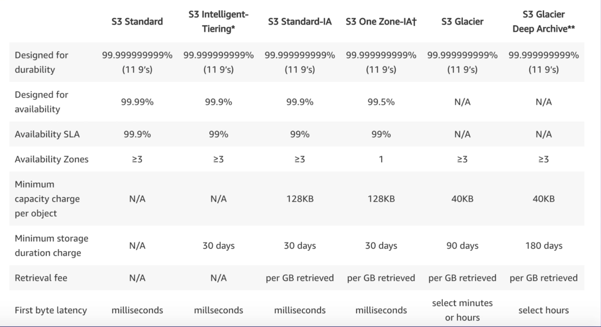

> provides secure, durable, highly-scalable object storage.

- Object-based storage
  - manage data as objects
  - opposed to file systems(data as files) or block storage(data as blocks)
- serverless storage in the cloud
- not suitable to install an OS or a database on. (**files only**)
- Storage size
  - individual objects : **"0" bytes ~ 5TB**
  - by single PUT request : maximum 5GB
  - larger than 100MB : consider multipart uploads
- unlimited storage
- universal namespace : name must be unique globally (like having a domain name)
- receive **HTTP 200** code if file upload was successful.
- can turn on **MFA**(Multi-Factor Authentication) to delete

### S3 Object

- Objects contain data like files.
- Object consists of
  - Key : name of the object
  - Value : the data itself made up of a sequence of bytes
  - Version ID : the version of object (when versioning enabled)
  - Metadata : additional information
  - Subresources (Access Control Lists, Torrent)

### S3 Bucket

- Objects are stored in **Buckets**.
  - maximum 100 buckets per account
  - can increase bucket limit to max 1,000 buckets by submitting a service limit increase.
- When create a bucket, choose its name and the Region to create it in.
  - After creation, can't change its name or Region.

## S3 - Storage Classes

*Order by higher price to lower price

- Standard (default)
  - 99.99% availability, 99.999999999% (11 x 9s) durability
  - stored across multiple devices in multiple facilities (at least 3 AZs)
- Intelligent-Tiering
  - same price as standard (= more beneficial than standard)
  - use machine learning
  - optimize costs by automatically moving data to the most cost-effective access tier (without performance impact or operational overhead)
- Standard-IA (Infrequently Accessed)
  - accessed less frequently
  - rapid access when needed
  - lower fee than Standard(almost 50% less), charge a retrieval fee
- One Zone-IA
  - only exist in one AZ
  - 99.5% availability
  - cheaper than Standard-IA by 20% less, charge a retrieval fee
  - data can be lost (suitable when data can be reproduced easily)
- Glacier
  - for long-term backups & data archiving
  - retrieval time : configurable - from 1min to 12hrs
- Glacier Deep Archive
  - lowest-cost
  - when accessed once or twice a year
  - retrieval time : within 12 hrs

## S3 Lock Policies

### S3 Object Lock

- to store objects using WORM (Write Once, Read Many) model.
  - prevent objects from being deleted or modified for a fixed amount of time or indefinitely.
- to meet regulatory requirements
- or to add an extra protection against object changes and deletion.
- can be on individual objects or applied across the bucket.
- Modes
  - **Governance Mode**
      - users can't overwrite/delete an object version or alter its lock settings
      - still can give permission to alter the retention settings or delete.
  - **Compliance Mode**
      - a protected object version can't be overwritten or deleted by any user. (incl. root user)
      - can't be changed during retention period.

### Glacier Vault Lock

- easily deploy and enforce compliance controls for individual S3 Glacier vaults with a Vault Lock policy.

## S3 - Performance

`mybucketname/folder1/subfolder1/myfile.jpg` → Prefix: `/folder1/subfolder1`

- better performance by using deeper level of prefixes.

## S3 - Security

- default: all newly created buckets are **private**.
- Access control is configured using
  - **ACL** (Access Control Lists) : simple way of granting access
  - **Bucket Policies** : use a policy to define complex rule access (in JSON format)
- **Access logs** can be configured to create.
  - Logging per request can be turned on a bucket.
  - Log files are generated and saved in a different bucket. (even a bucket in a different AWS account if desired)

## S3 - Encryption

- Encryption In Transit : via **SSL/TLS**
- Encryption At Rest
  - Client-Side Encryption: by user (after encrypted by user, and then upload objects to S3)
  - Server-Side Encryption (SSE) : by Amazon

### Types of SSE (Server-Side Encryption)

> key = a way of encrypting & decrypting object

- SSE-S3
  - S3-managed keys
  - use AES-256 algorithm
- SSE-KMS
  - Envelope encryption via AWS KMS(Key Management Service)
  - User manage keys
- SSE-C
  - Customer provided keys
  - user gives own keys to Amazon that user manages and user can encrypt S3 objects

## S3 - Data Consistency

- Read after Write consistency
  - **PUTS** for new objects
  - = when upload a new S3 object, can **read immediately** after writing.
- Eventual consistency
  - **PUTS** to overwrite or **DELETES** to delete
  - = when overwrite or delete an existing file, it takes time to replicate versions to AZs.
  - if read immediately, S3 may return an old copy. Need to generally wait a few seconds before reading.

## S3 - Versioning

- Store ALL versions of an object (incl. all writes)
  - even if delete an object, versions will still exist.
- Great backup tool
- Once enabled, versioning **cannot be disabled**, only suspended.
- Fully integrate with S3 **Lifecycle** rules
- MFA delete : extra protection
  - need to provide MFA code to delete objects
  - Must turn on MFA delete only from **AWS CLI**
  - **Versioning** must be turned on.
  - Only the bucket owner logged in as **Root user** can delete objects.

## S3 - Lifecycle Management

- Automate the process of moving objects to different storage classes or deleting objects.
  - e.g. After 7 days, move to Glacier & after 1 year, permanently delete.
- Manage an object's lifecycle by using a lifecycle rule.
- Can be used together with versioning.
  - applied to both current & previous versions.
- Automatically expire objects
- Clean up incomplete multipart uploads

## S3 - Cross-Region Replication (CRR)

- When enabled, uploaded objects will be **automatically replicated** to another region(s).
- **Versioning** required (both source & destination buckets)
- Can have CRR replicate to another AWS account.
- Regions must be unique.
- Files in an existing bucket are NOT replicated automatically.
  - All subsequent updated files will be replicated automatically.
- Delete markers are not replicated.
  - Files in replicated bucket still exist even if deleting original files.
  - Deleting each versions of original or delete marker doesn't affect replicated bucket.

## S3 - Transfer Acceleration

- Fast & secure transfer of files **over long distances** between end users and S3 bucket.
- Instead of uploading to bucket, users use a distinct URL for an **Edge Location** nearby.
- As data arrives at the Edge Location, it's automatically routed to S3 bucket over a specially optimized network path. (= **Amazon's backbone network**)
- Utilizes CloudFront's distributed Edge Locations.

## S3 - Presigned URLs

- Generate a URL for **temporary** access to an object to either upload or download object data.
- Commonly used to **provide access to private objects**. (expires soon)
- Use AWS CLI or SDK to generate a URL.

## Cross-Account Access

### < 3 ways to share S3 buckets across accounts >

- use Bucket Policies & IAM
  - for across entire bucket
  - programmatic access only (console X)
- use Bucket ACLs & IAM
  - ACL = Access Control Lists
  - for individual objects
  - programmatic access only (console X)
- cross-account IAM roles
  - programmatic & console access

## AWS Organizations

- always use **MFA**, strong&complex password on root account
- paying account is for billing purposes only. Don't deploy resources into paying account.
- enable/disable AWS services using SCP(Service Control Policies) either on OU or on individual accounts.

## CloudFront

- deliver data using a global network of edge locations
- requests for content are automatically routed to the nearest edge location
- so content is delivered with the best possible performance

**< Edge Locations >**
- not just READ only (can write to them too)
- objects are cached for the life of the TTL (Time To Live)
- invalidate cache = can clear cached objects (will be charged)

**< CDN (Content Delivery Network) >**
- a system of distributed servers or network
- deliver webpages/web content to a user
- based on
  - geographic locations of user
  - origin of webpage
  - content delivery server

**< Tips >**
- Origin : origin of all the files that CDN will distribute.
- Distribution : the name given CDN which consists of a collection of edge locations.
- Delivery methods
  - Web Distribution : typically used for Websites
  - RTMP : used for media streaming

# Snowball

- Physically migrate **petabyte-scale** datasets into/out of AWS
- Use secure appliances (physical briefcase computer) to transfer large amounts of data
- E-Ink display (for shipping information) and tamper, weather proof
- 5x **cheaper** than high-speed internet
- Comes in 2 sizes : **50TB** or **80TB**
- Fast transfer speed : takes less than a week for 100TB transfer.
- Use multiple layers of security
- Data is encrypted end-to-end (256-bit encryption)
- For security, data transfers must be completed within **90 days** of the Snowball being prepared.
- Can import/export from S3 bucket.

### Snowball Edge

- Similar to Snowball, but with **more storage** and **on-site compute capabilities**.
- LCD display (shipping information and other functionality)
- Comes in 2 sizes : **100TB** (83TB of usable space) or 100TB Clustered (45TB per node)
- As a temporary storage tier for large local datasets
- Like portable version of AWS

### Snowmobile

- **Exabyte-scale** data transfer service
- 45-foot long ruggedized **shipping container**, pulled by a **semi-trailer truck**.
- One size : **100PB**
- AWS personnel will help to connect network to the Snowmobile,
- and when data transfer is complete, they'll drive it back to AWS to import into S3 or Glacier.

## Storage Gateway

- physical or virtual appliance that can be used to cache S3 locally on site
- enable hybrid cloud storage between on-premises environments and AWS Cloud.
- provide low-latency performance by
  - caching frequently accessed data on premises,
  - storing data in cloud storage.

### File Gateway (NFS & SMB)

- for flat files
- stored directly on S3

### Volume Gateway (iSCSI)

- Stored Volumes
  - entire dataset is stored **on site**
  - asynchronously backed up to S3
- Cached Volumes
  - entire dataset is stored **on S3**
  - most frequently accessed data is cached on site

### Tape Gateway (VTL - Virtual Tape Library)

- for backup (using popular backup applications)

## Athena vs Macie

### Athena

- interactive **query** service
- allow you to query data in S3
- use standard **SQL**
- serverless
- used to analyse log data in S3

### Macie

- **security** service
- use **AI** (Machine Learning & NLP)
- to discover/classify/protect sensitive data stored in S3
- used to recognise if S3 objects contain sensitive data like **PII**
  - PII = Personally Identifiable Information
  - personal data used to establish an individual's identity