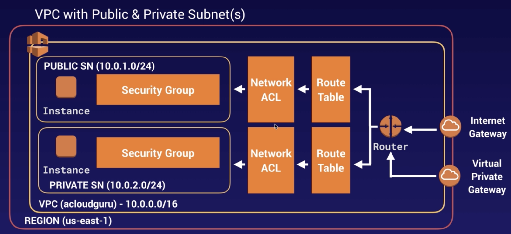
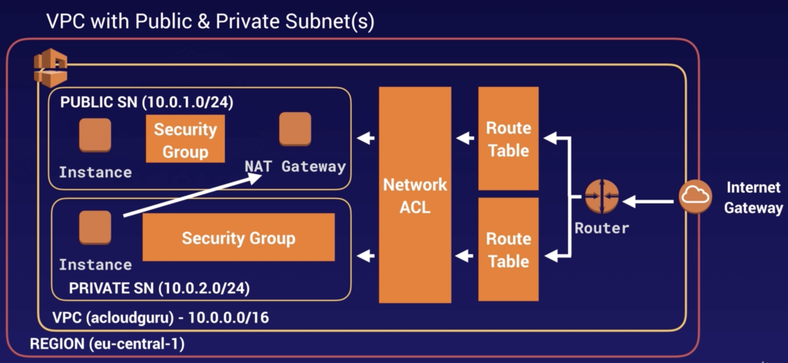
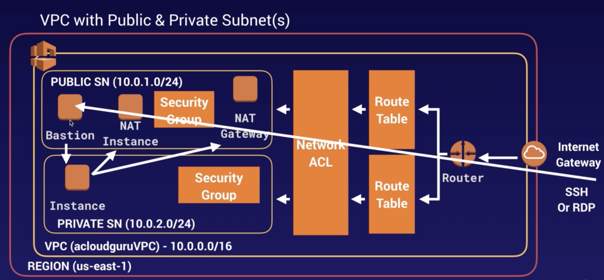
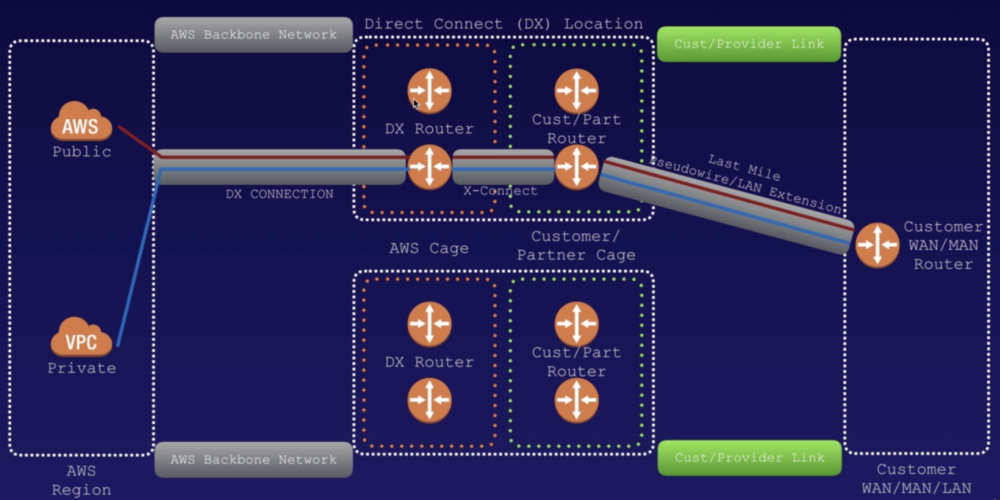

- Think as a personal logical data center in AWS
- Provision a **logically isolated section of AWS cloud** where you can launch AWS resources in a **virtual network** that you define.
- Have complete control over your **virtual networking environment**
- can easily customize network configuration for VPC
- Need at least **2 public subnets** in order to create load balancer.
- VPCs are **region specific** (do not span regions)
- Create up to **5** VPC per region.
- Have **200 subnets** per VPC.

### What can do with VPC

- launch instances into a subnet of your choosing
- assign custom IP address ranges in each subnet
- configure route tables between subnets
- create internet gateway and attach it to our VPC
- much better security control over your AWS resources
- instance security groups
- subnet network ACLs(Access Control Lists)

- router direct traffic to different route tables
- route tables direct traffic through network ACL
- 1 subnet = 1 AZ

## Default VPC

- Every region comes with a default VPC.
- Can deploy instances **immediately**
- user friendly
- All subnets in default VPC have a route out to the internet
- Each EC2 instance has public & private IP address
- if you delete default VPC, you can recover it.

## VPC Peering

- Connect one VPC with another via **direct network route** using **private IP addresses**.
- Instances on peered VPCs behave as if they are on the same private network.
- Peer with other VPCs in same account / other AWS accounts / other regions.
- Star configuration
  - 1 central VPC peers with 4 other VPCs (star★ shape)
  - **NO transitive peering**
      - Peering must be directly between VPCs
      - = A-B peered & B-C peered → doesn't mean A-C peered

## Build VPC

- when you create a VPC
  - default Route table/ Network ACL/ security group
  - not create subnets/ internet gateway
- AZ's are randomized
  - US-East-1A in your AWS account can be different AZ in another account
- always reserve 5 IP addresses within subnets
- can only have 1 internet gateway per VPC
- security groups can't span VPCs

## Route Tables

- Determine where network traffic is directed.
- Each subnet in VPC **must be associated** with a route table.
  - One route table at a time.
  - Multiple subnets can be associated with the same route table.

## Internet Gateway (IGW)

- Allow VPC access to the internet.
- What it does?
  - Provide a target in VPC route tables for internet-routable traffic.
  - Perform NAT for instances that have been assigned **public** IPv4 addresses.

## NACL (Network Access Control Lists)

- Layer of security acting as a virtual firewall for controlling traffic in/out of subnets.
- Have separate **inbound/outbound** rules set.
  - Each rule can either **allow** OR **deny** traffic in/out of subnets.
  - ↔︎ Security Groups can only allow. cannot deny.
  - Can **block IP addresses**. (can't do this with Security Groups)
- VPCs automatically get a **default NACL**.
  - default : **Allow** all inbound/outbound traffic.
- Can create **custom NACLs**.
  - default : **Deny** all inbound/outbound traffic until you add rules.
- Subnets must be associated with NACL.
  - If not, subnet is automatically associated with default NACL.
  - When associate NACL with a subnet, previous association is removed.
  - One NACL can be associated with multiple subnets,
  - but subnet can be associated with only one NACL at a time.
- Rule # : determines the **order of evaluation**. (From lowest to highest)
- Stateless - Responses to allowed inbound traffic are subject to the rules for outbound traffic & vice versa.
  - = Any changes applied to an inbound rule will not be applied to the outbound rule.
  - e.g. if you allow an inbound port 20, also need to apply the rule for outbound traffic.

## Security Groups

- A virtual firewall controlling the traffic in/out of EC2 instances.
- Provide security at the **protocol** and **port** access level.
- **No deny** rules.
  - Cannot block specific IP addresses.
- All inbound traffic is **blocked** by default.
- All outbound traffic from the instance is **allowed** by default.
- Multiple instances across multiple subnets can belong to one Security Group.
- Stateful : Any changes applied to an inbound rule will be automatically applied to the outbound rule.
  - = If traffic is allowed inbound, it's also allowed outbound.
- Limits
  - Max 10,000 Security Groups in a Region
  - 60 inbound rules & 60 outbound rules per Security Group
  - 16 Security Groups per ENI

## VPC Flow Logs

- Capture IP traffic information in/out of network interfaces within VPC.
- Delivered to an **S3** or **CloudWatch Logs**.
- All log data is stored using CloudWatch Logs.
  - After creating a flow log, you can view/retrieve all traffic in CloudWatch Logs.
- Contains source & destination **IP addresses**. (not hostnames)
- Can be created for 3 levels.
  - VPC
  - Subnets
  - Network Interface
- Cannot enable flow logs for VPCs that are peered with your VPC unless peer VPC is in the same account.
  - = you can definitely have VPC flow logs between peer VPC.
  - but only within same AWS account, not across accounts.
- After creation, cannot change configuration.

## NAT (Network Address Translation)

- Method of re-mapping one IP address space into another.
- To enable EC2 instances in a **Private subnet** to gain outbound access to the internet or other AWS services.
- NATs must exist in a **Public Subnet**.

> Use NAT Gateways(new) rather than NAT instances(old). Because they provide better availability and bandwidth.

### NAT Gateways

- Redundant instances inside selected AZ.
  - Only have 1 NAT Gateway in 1 AZ. (cannot span AZs)
- Start at 5 Gbps, up to 45 Gbps
- Not associated with Security Groups.
- Route tables must be updated.
- Automatically assigned public IP address.
- No need to disable source/destination checks and no requirement to patch.

### NAT Instances

- Individual EC2 instances.
- When creating, you must **disable source/destination checks** on instance.
- There must be a route out of private subnet to NAT instance.
- Size of NAT instance determines how much traffic can be handled.
  - If you have bottleneck, increase NAT instance size.
- High availability can be achieved using :
  - Autoscaling groups, multiple subnets in different AZs, a script to automate failover.
- Located behind Security Group.

## Bastion Host

- a special purpose computer on network specifically designed/configured to **withstand attacks**
- generally host a single application

- EC2 instances in private subnet
  - access internet via either **NAT instance or NAT gateway**.
- when get SSH or RDP request,
  - through internet gateway - route table - NACL - SG - Bastion
  - bastion server basically forward connection to instances in private subnet
  - bastion host is harden strongly
  - then you don't need to worry about hardening instances in private subnet
  - = bastion이 공격을 다 막아주니까 private subnet에서는 걱정할 필요가 X. bastion을 hardening하는 거에만 집중하면 됨
- Bastion = a way of SSHing or RDPing to instances in private subnet
- cannot use NAT gateway as a bastion host

## Direct Connect

- Directly connect from on-premises data center to AWS - dedicated & private network connection
- Reduce network costs, increase bandwidth throughput
- Provide **more consistent** network experience than internet-based connections
- Useful for high throughput workloads (e.g. lots of network traffic)
- When you need a stable/reliable/**fast** secure connection
- Create **public** virtual interface in Direct connect console.

## VPC Endpoints

- Like a secret tunnel where you don't have to leave the AWS network.
- **Privately connect** your VPC to other AWS services/VPC endpoint services
- Eliminates the need for : Internet Gateway, NAT device, VPN connection, AWS Direct Connect.
- Instances in VPC **don't require public IP addresses** to communicate with resources in the service.
- Help keep traffic between VPC and other services : **doesn't leave** AWS network.
- Horizontally scaled, redundant, highly available.

### 2 Types of VPC Endpoints

- Interface Endpoint
  - **ENI**(Elastic Network Interface) with a **private** IP address.
  - Powered by AWS PrivateLink.
  - Serve as an entry point for traffic going to a supported service.
  - Cost money
  - Supports many AWS services.
  - Attach ENI to EC2 instance
      - can communicate to services using Amazon internal network
      - no need to traverse Internet
- Gateway Endpoint
  - A gateway that is a target for a specific route in your route table.
  - Only supports 2 services : **S3, DynamoDB**
  - Free of charge
  - from instance in private subnet,
      - send files to VPC gateway,
      - and gateway send that file to S3 bucket.
      - then it'll not leave Amazon network.
  - Must specify VPC in which you want to create the endpoint, and the service to which you want to establish the connection.

## Global Accelerator

- to improve availability/performance of your applications for users
- direct traffic to optimal endpoints over AWS global network

### Without Global Accelerator

Take many networks to reach the application. Paths to and from the application may differ. Each hop impacts performance and can introduce risks.

### With Global Accelerator

Adding Global Accelerator removes these inefficiencies. It leverages the Global AWS Network, resulting in improved performance.

### Components of Global Accelerator

- **Static IP addresses**
  - default : have **two** static IP addresses that you associate with your accelerator
  - you can bring your own as well.
- **Accelerator**
  - direct traffic to optimal endpoints over AWS global network
  - each accelerator includes one or more listeners
- **DNS Name**
  - assign each accelerator default DNS name
      - similar to 'a1234567890abcdef.awsglobalaccelerator.com'
  - point to static IP addresses
  - use static IP address or DNS name to route traffic to your accelerator
  - or set up DNS records to route traffic using own custom domain name
- **Network Zone**
  - service static IP addresses for your accelerator from a unique IP subnet
  - similar to AZ, but network zone is an isolated unit with its own set of physical infrastructure
  - 기본으로 지정받는 두개의 IP주소중에서 하나가 작동하지 않을때, 다른 isolated network zone에 있는 healthy IP주소로 다시 retry함
- **Listener**
  - process inbound connections from clients to Global accelerator, based on port/protocol
  - each listener has one or more endpoint groups with it, and traffic is forwarded to endpoints in one of the groups
  - associate endpoint groups with listeners by specifying Regions that you want to distribute traffic to.
  - traffic is distributed to optimal endpoints within endpoint groups associated with a listener.
- **Endpoint Group**
  - each endpoint group is associated with specific AWS Region
  - include one or more endpoints in Region
  - control traffic using **traffic dials**. done within endpoint group
- **Endpoint**
  - can be Network Load Balancers, Application Load Balancers, EC2 instances, or Elastic IP addresses
  - traffic is routed to endpoints based on configuration
  - for each endpoint, you can configure weights (proportion of traffic)