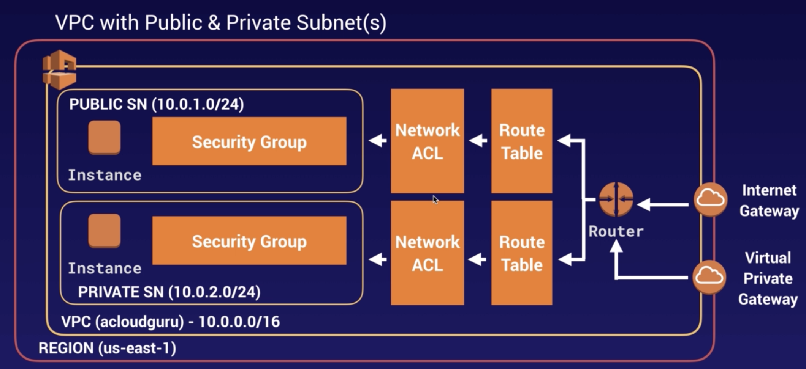
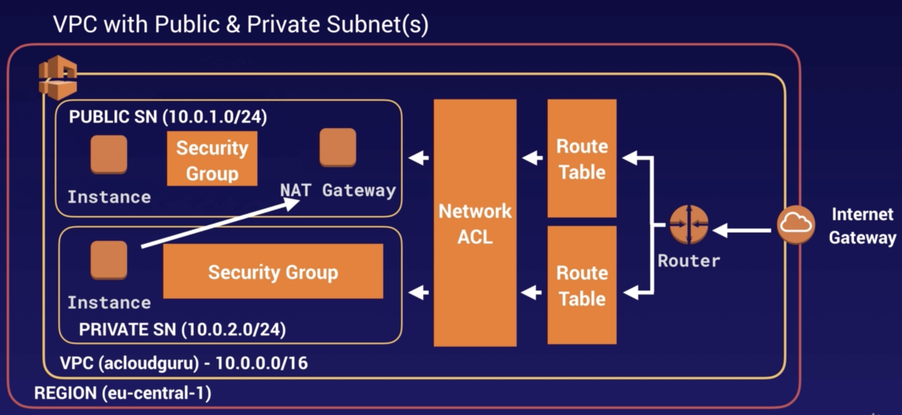
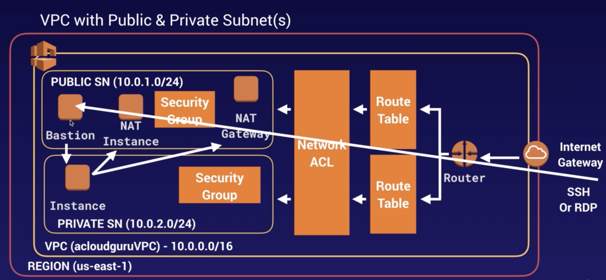
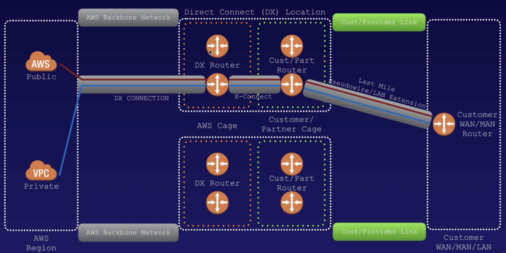

> This note was taken while learning AWS on <a href='https://www.udemy.com/course/aws-certified-solutions-architect-associate/' target='__blank'>Udemy</a>.

# VPC (Virtual Private Cloud)

- think as a logical data center in AWS
- let you provision a logically isolated section of AWS cloud where you can launch AWS resources in a virtual network that you define.
- have complete control over your virtual networking environment
- can easily customize network configuration for VPC
- you need at least **2 public subnets** in order to create load balancer

### What can do with VPC

- launch instances into a subnet of your choosing
- assign custom IP address ranges in each subnet
- configure route tables between subnets
- create internet gateway and attach it to our VPC
- much better security control over your AWS resources
- instance security groups
- subnet network ACLs(Access Control Lists)

- router direct traffic to different route tables
- route tables direct traffic through network ACL
- network ACL
  - first line of defense
  - act like firewalls, security groups
  - **stateless** - you can allow/deny rules, block specific IP address
- 1 subnet = 1 AZ
- security group
  - **stateful** : by allowing inbound, it automatically allows outbound as well
  - act as a further line of defense

## Default VPC vs Custom VPC

- Default VPC
  - user friendly
  - can deploy instances immediately
  - all subnets in default VPC have a route out to the internet
  - each EC2 instance has public&private IP address
  - if you delete default VPC, you can recover it 
- Custom VPC

## VPC Peering

- can connect one VPC with another via direct network route using private IP addresses
- instances behave as if they were on the same private network
- peer with other AWS accounts / other VPCs in same account
- star configuration
  - 1 central VPC peers with 4 others (별★모양으로 연결)
  - **NO transitive peering** (a-b연결, b-c연결이라고해서 a-c연결인게아님)
- can peer between regions

## Build VPC

- when you create a VPC
  - default Route table/ Network ACL/ security group
  - not create subnets/ internet gateway
- AZ's are randomized
  - US-East-1A in your AWS account can be different AZ in another account
- always reserve 5 IP addresses within subnets
- can only have 1 internet gateway per VPC
- security groups can't span VPCs

# NAT (Network Address Translation)

### NAT Gateways

- always located in **public** subnet
- to enable instances in a private subnet to connect to the internet or other AWS services
- redundant inside AZ
- start at 5Gbps, up to 45Gbps
- no need to patch
- not associated with security groups
- automatically assigned public IP address
- remember to update route tables
- no need to disable Source/Destination checks
- create in each AZ, configure routing 
- For common use cases, Amazon recommend that you use a NAT gateway rather than a NAT instance.

### NAT Instances

- NAT instance in a public subnet to enable instances in the private subnet to initiate outbound IPv4 traffic to the Internet or other AWS services
- when creating, disable source/destination check on instance
- must be in public subnet
- there must be a route out of private subnet to NAT instance
- the amount of traffic that NAT instances can support - depend on the instance size
  - if you have bottleneck, increase instance size
- can create high availability
  - using Autoscaling groups/ multiple subnets in different AZs/ a script to automate failover
- located behind security group

# ACL (Access Control Lists)

- VPC automatically come with a **default network ACL**
  - default : **allow** all inbound/outbound traffic
- can create **custom network ACLs**
  - default : **deny** all inbound/outbound traffic until you add rules
- each subnet in VPC must be associated with network ACL
  - if you don't do that, subnet is automatically associated with default network ACL
- block IP addresses using network ACLs (not security groups)
- can associate NACL with multiple subnets
  - but subnet can be associated with only one NACL at a time
  - when you associate NACL with a subnet, previous association is removed.
- NACL (Network ACL)
  - contain a numbered list of rules that is evaluated in order, starting with the lowest numbered rule
  - have separate inbound/outbound rules
      - each rule can either allow OR deny traffic
  - **stateless** - response to allowed inbound traffic are subject to rules for outbound traffic & vice versa

# VPC Flow Logs

- enable you to capture information about IP traffic going to/from network interfaces in VPC
- log data is stored using CloudWatch Logs
  - after creating a flow log, you can view/retrieve all traffic in CloudWatch Logs
- can be created at 3 levels
  - VPC / Subnet / Network Interface Level
- cannot enable flow logs for VPCs that are peered with your VPC unless peer VPC is in your account
  - = you can definitely have VPC flow logs between peer VPC 
  - but they need to be within same AWS account, not across accounts
- after creation, cannot change configuration

# Bastion Host

- a special purpose computer on network specifically designed/configured to **withstand attacks**
- generally host a single application

- EC2 instances in private subnet
  - access internet via either **NAT instance or NAT gateway**.
- when get SSH or RDP request,
  - through internet gateway - route table - NACL - SG - Bastion
  - bastion server basically forward connection to instances in private subnet
  - bastion host is harden strongly
  - then you don't need to worry about hardening instances in private subnet
  - = bastion이 공격을 다 막아주니까 private subnet에서는 걱정할 필요가 X. bastion을 hardening하는 거에만 집중하면 됨
- Bastion = a way of SSHing or RDPing to instances in private subnet
- cannot use NAT gateway as a bastion host

# Direct Connect

- directly connect your data center to AWS - **dedicated & private** network connection
- reduce network costs, increase bandwidth throughput, provide more consistent network experience than internet-based connections
- useful for high throughput workloads (ex. lots of network traffic)
- when you need a stable/reliable secure connection
- create **public** virtual interface in Direct connect console

# Global Accelerator

- to improve availability/performance of your applications for users
- direct traffic to optimal endpoints over AWS global network

## Without Global Accelerator

Take many networks to reach the application. Paths to and from the application may differ. Each hop impacts performance and can introduce risks.

## With Global Accelerator

Adding Global Accelerator removes these inefficiencies. It leverages the Global AWS Network, resulting in improved performance.

### Components of Global Accelerator

- **Static IP addresses**
  - default : have **two** static IP addresses that you associate with your accelerator
  - you can bring your own as well.
- **Accelerator**
  - direct traffic to optimal endpoints over AWS global network
  - each accelerator includes one or more listeners
- **DNS Name**
  - assign each accelerator default DNS name
      - similar to 'a1234567890abcdef.awsglobalaccelerator.com'
  - point to static IP addresses
  - use static IP address or DNS name to route traffic to your accelerator
  - or set up DNS records to route traffic using own custom domain name
- **Network Zone**
  - service static IP addresses for your accelerator from a unique IP subnet
  - similar to AZ, but network zone is an isolated unit with its own set of physical infrastructure
  - 기본으로 지정받는 두개의 IP주소중에서 하나가 작동하지 않을때, 다른 isolated network zone에 있는 healthy IP주소로 다시 retry함
- **Listener**
  - process inbound connections from clients to Global accelerator, based on port/protocol
  - each listener has one or more endpoint groups with it, and traffic is forwarded to endpoints in one of the groups
  - associate endpoint groups with listeners by specifying Regions that you want to distribute traffic to.
  - traffic is distributed to optimal endpoints within endpoint groups associated with a listener.
- **Endpoint Group**
  - each endpoint group is associated with specific AWS Region
  - include one or more endpoints in Region
  - control traffic using **traffic dials**. done within endpoint group
- **Endpoint**
  - can be Network Load Balancers, Application Load Balancers, EC2 instances, or Elastic IP addresses
  - traffic is routed to endpoints based on configuration
  - for each endpoint, you can configure weights (proportion of traffic)

# VPC Endpoint

- virtual devices
- privately connect your VPC to supported AWS services/VPC endpoint services
- powered by PrivateLink
- without requiring internet gateway, NAT device, VPN connection, AWS direct connect
- instances in VPC don't require public IP addresses to communicate with resources in the service
- traffic between VPC and other service - doesn't leave Amazon network

## Types of VPC Endpoint

### Interface Endpoint

- an ENI(Elastic Network Interface) with a private IP address that serves as an entry point for traffic destined to a supported service
- attach ENI to EC2 instance
  - can communicate to services using Amazon internal network
  - no need to traverse Internet

### Gateway Endpoint

- supported for **S3, DynamoDB**
- from instance in private subnet,
  - send files to VPC gateway,
  - and gateway send that file to S3 bucket.
  - then it'll not leave Amazon network.