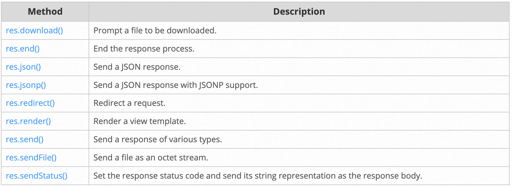

- <span>Routing</span> : Determining how an application responds to a client request to a particular endpoint, which is a URI (or path) and a specific HTTP request method.

## Route Methods

- `app.METHOD()` : handle a specific HTTP method
  - e.g. `app.get()` to handle GET requests, `app.post()` to handle POST requests.
- `app.all()` : handle **all** HTTP methods
- `app.use()` : specify middleware as the callback function
- With multiple callback functions
  - Provide `next` as an argument to the callback function,
  - and then call `next()` within the body of the function to pass control to the next callback.

```js
app.get('/', (req, res) => {
  res.send('GET request to the homepage');
});

app.post('/', (req, res) => {
  res.send('POST request to the homepage');
});

app.all('/secret', (req, res, next) => {
  console.log('Accessing the secret section...');
  next();      // pass control to the next handler
});
```

## Route Paths

- e.g. `app.get('/about', (req, res) => {});` : `/about` is a route path.
- Regular expressions for route paths.
  - `'/ab?cd'` : match - acd or abcd
  - `'/ab+cd'` : match - abcd, abbcd, abbbcd, ...
  - `'/ab*cd'` : match - abcd, abxcd, abRANDOMcd, ab123cd, ...
  - `'/ab(cd)?e'` : match - abe or abcde

## Route Parameters

- Route path: `/users/:userId/books/:bookId`
  - Request URL: `/users/34/books/8989`
  - req.params: `{ "userId": "34", "bookId": "8989" }`
- Route path: `/flights/:from-:to`
  - Request URL: `/flights/LAX-SFO`
  - req.params: `{ "from": "LAX", "to": "SFO" }`
- Route path: `/plantae/:genus.:species`
  - Request URL: `/plantae/Prunus.persica`
  - req.params: `{ "genus": "Prunus", "species": "persica" }`
- Have more control over the exact string, append a regular expression in parentheses (`()`).
  - Route path: `/user/:userId(\d+)`
  - Request URL: `/user/42`
  - req.params: `{ "userId": "42" }`

## Route Handlers

- Normal callback function

```js
app.get('/', (req, res) => {
  res.send('Hello!');
});
```

- Multiple callback functions

```js
app.get('/', (req, res, next) => {
  console.log('the response will be sent by the next function.');
  next();
}, (req, res) => {
  res.send('Hello!');
});
```

```js
// An array of callback functions
const func1 = (req, res, next) => {
  console.log('Hello from func1');
  next();
}

const func2 = (req, res, next) => {
  console.log('Hello from func2');
  next();
}

const func3 = (req, res, next) => {
  res.send('Final hello!');
}

app.get('/', [func1, func2, func3]);
```

```js
// A combination of independent functions and arrays of functions.
app.get('/', [func1, func2], (req, res, next) => {
  console.log('the response will be sent by the next function.');
  next();
}, (req, res) => {
  res.send('Hello!');
});
```

## Response Methods

- The methods on the response object (`res`) can **send a response** to the client, and **terminate** the request-response cycle.
- If none of these methods are called from a route handler, the client request will be left hanging.



## app.route()

- Create <span>chainable route handlers</span> for a route path by using `app.route()`

```js
app.route('/user')
  .get((req, res) => {
    res.send('Get a random user');
  })
  .post((req, res) => {
    res.send('Add a user');
  })
  .put((req, res) => {
    res.send('Update the user');
  });
```

## express.Router

- Create modular, mountable route handlers.
- A `Router` instance is a complete middleware and routing system.
  - often referred to as a "mini-app"

```js
// books.js
const express = require('express');
const router = express.Router();

// middleware that is specific to this router
router.use((req, res, next) => {
  console.log('Time: ', Date.now());
  next();
});

router.get('/', (req, res) => {
  res.send('Home page');
});

router.get('/about', (req, res) => {
  res.send('About page');
});

module.exports = router;
```

```js
// Load the router module in the app.
const books = require('./books');

app.use('/books', books);
```

- The app will now be able to handle `GET` requests to `/books` and `/books/about`, as well as call the middleware function that is specific to the route.