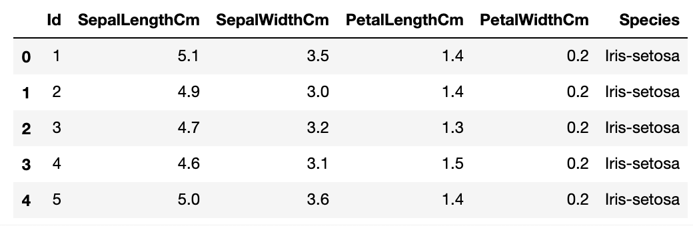
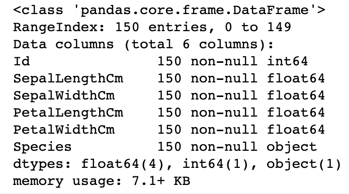
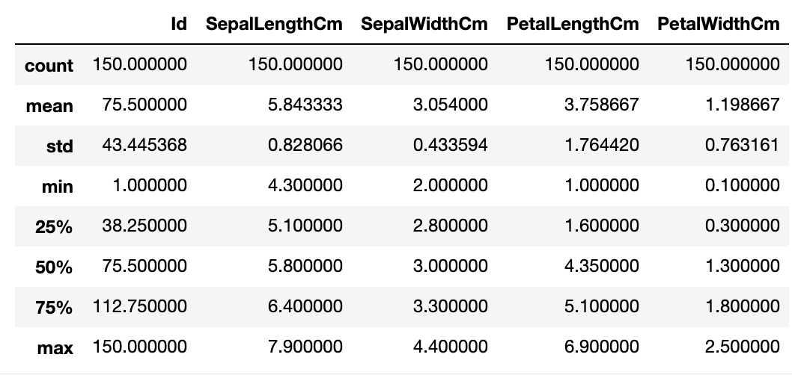
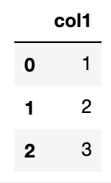
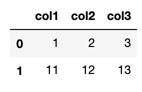
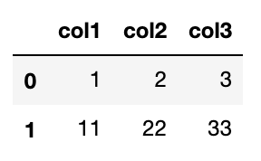

**Pandas:** Python에서 데이터처리를 위해 존재하는 가장 인기있는 라이브러리. 2차원 데이터를 효율적으로 가공,처리함.

### Pandas의 핵심 객체 = DataFrame
- 여러 개의 행과 열로 이뤄진 2차원 데이터를 담는 데이터 구조체
- **Index** : 개별 데이터를 고유하게 식별하는 key값. Series, DataFrame은 모두 Index를 key값으로 가짐.
- **Series** : 열이 하나뿐인 데이터 구조체
- **DataFrame** : 열이 여러개인 데이터 구조체. DataFrame은 여러개의 Series로 이뤄짐.

```python
import pandas as pd
```

---

# 1. DataFrame

### read_csv( )
파일 로딩하기

- csv : 열을 `콤마(,)`로 구분
- 콤마 외에 다른 문자로 구분하려면 : read_csv(‘파일명’, `sep=‘\t’`)
- `read_table( )` : 열을 탭으로 구분

```python
df = pd.read_csv('C:/Users/.../train.csv')
```



- csv 파일을 로딩해 DataFrame 객체로 반환
- 별다른 지정 없으면, csv 파일 첫번째 줄의 문자열을 칼럼명으로.
- 맨 왼쪽의 0,1,2,3,… 숫자들이 Pandas의 Index 값
  - 모든 DataFrame 내의 데이터는 생성되는 순간 고유의 Index값을 가짐

## < Explore DataFrame >

### df.head(N)
df의 맨 앞에 있는 N개의 행 표시하기 (기본값 5개)

### df.shape
df 크기 알아보기. 행과 열을 tuple 형태로 반환.

### df.info( )
총 데이터 건수, 데이터 타입, Null 건수 등


### df.describe( )
- 숫자형 데이터값의 분포도, 평균값, 최대값, 최소값 등
- 오직 숫자형 열만 조사. object 타입의 열은 자동으로 출력에서 제외시킴


### df[‘column’].value_counts( )
- 칼럼 데이터값의 유형과 건수 확인하기
- df[ ] 안에 열명 입력하면 Series 형태로 특정 열의 데이터셋이 반환됨
- value_counts는 DataFrame 전체에는 적용 안되고 **Series에만 적용**됨. (그래서 df['열'] 이렇게 해당 열을 지정해줘야함)

## < ndarray, 리스트 → DataFrame로 변환하기 >

DataFrame은 column명을 가지고 있어서, DataFrame으로 변환시 이 column명을 지정해줘야함.
  - 미지정시 자동으로 column명을 할당

```python
colname = ['col1']

# 리스트를 이용해 DataFrame 생성 (columns인자로 column명 지정)
df_list = pd.DataFrame([1, 2, 3], columns=colname)
 
# NumPy ndarray를 이용해 DataFrame 생성
df_array = pd.DataFrame(np.array([1, 2, 3]), columns=colname)
```



```python
colname = ['col1', 'col2', 'col3']
 
df_list = pd.DataFrame([[1, 2, 3], [11, 12, 13]], columns=colname)
df_array = pd.DataFrame(np.array([[1, 2, 3], [11, 12, 13]]), columns=colname)
```



## < 딕셔너리 → DataFrame로 변환하기 >
- key값은 column명으로, value값은 해당 column의 데이터로 변환
- key는 문자열로, value는 리스트나 ndarray 형태로 딕셔너리를 구성

```python
dict = {'col1':[1, 11], 'col2':[2, 22], 'col3':[3, 33]}
df_dict = pd.DataFrame(dict)
```


## < DataFrame → ndarray, 리스트, 딕셔너리로 변환하기 >

### df.values
DataFrame → **ndarray**

```python
arr = df.values
 
>>> arr
[[ 1,  2,  3],
 [11, 22, 33]]   # NumPy의 ndarray 타입으로 변환됨
```

### df.values.tolist( )
DataFrame → **리스트**
- `df.values`로 얻은 ndarray에 `tolist( )` 호출

```python
lis = df.values.tolist()
 
>>> lis
[[1, 2, 3], [11, 22, 33]]
```

### df.to_dict(‘list’)
DataFrame → **딕셔너리**
- 인자로 ‘list’ 입력하면 딕셔너리의 value값이 리스트형으로 반환
- 인자로 아무것도 입력안하면 value값이 딕셔너리

```python
dict = df.to_dict('list')
 
>>> dict
{'col1':[1, 11], 'col2':[2, 22], 'col3':[3, 33]}
 
dict = df.to_dict()
 
>>> dict
{'col1': {0: 1, 1: 11}, 'col2': {0: 2, 1: 22}, 'col3': {0: 3, 1: 33}}
```

---

# 2. DataFrame 생성, 수정, 삭제

## < 새로운 column 추가하기 >

- 새로운 series가 기존 DataFrame에 추가됨
- Series에 상수값을 할당하면 모든 데이터값이 일괄적으로 적용됨
- 기존 column의 데이터를 이용해 새로운 series를 만들수도 있음

```python
df['new'] = 0
df['age'] = 2019 - df['born']
df['age_by_10'] = df['age'] * 10
```

## < 기존의 column 데이터값 일괄 수정하기 >
```python
df['age_by_10'] = df['age_by_10'] + 100
```

## < DataFrame 데이터 삭제하기 >
```python
df.drop(labels=None, axis=0, inplace=False)
 
# 'name, age, address' column이 삭제된 df를 반환
drop_df = df.drop(['name', 'age', 'address'], axis=1)
```

- labels : 삭제 원하는 행의 인덱스값 or column명 입력
- axis : `axis=0` **행** 삭제, `axis=1` **열** 삭제
- inplace
    - 기본값 False → 원래 DataFrame은 그대로 유지 & drop된 DataFrame을 새로운 객체변수로 반환
    - `inplace=True` → 원래 DataFrame의 데이터를 삭제 & drop된 결과를 새롭게 적용. 반환되는 값은 `None`

---

# 3. Index 객체

### df.index
Index 객체값 확인하기

### df.index.values
Index 객체의 ndarray 값 확인하기

### df.reset_index( )
새롭게 인덱스를 연속 숫자형으로 할당. 기존 인덱스는 ‘index’라는 새로운 column명으로 추가.
  - Parameter값으로 drop=True 설정하면 기존 인덱스가 새로운 칼럼으로 추가되지 않고 삭제됨

---

# 4. Data Selection & Filtering

## < [ ] 연산자 >

- DataFrame 뒤의 [ ]에 칼럼을 지정해 칼럼 지정 연산에 사용
    - ex) `df[‘age’]`
- Index 형태로 변환가능한 표현식 (슬라이싱 or Boolean 인덱싱) 은 [ ]내에 입력 가능
    - df[0:2] : 첫 2개 데이터 행을 추출 → 가능은 하지만 이렇게 슬라이싱해서 데이터 추출하는 방식은 비추!
    - df[df[‘age’] == 30] : age열 값이 30인 데이터만 추출

> DataFrame[ ]에는 칼럼 지정 or Boolean 인덱싱으로만 사용할 것 !!!


## < ix[ ] 연산자 >
ix[행, 열] like `ix[0, 'age']` → 0번째 행 + 'age'열에 해당하는 데이터값 추출

- 행 : 행의 index값 (index가 숫자형일 경우 명칭 기반)
- 열 : 칼럼명 or 칼럼 index값

> 칼럼명과 칼럼의 index값 두개가 혼용되어 ix 연산자는 곧 사라지고, loc[ ]과 iloc[ ]으로 나뉘어짐. 혼동을 줄이기 위해 loc[ ], iloc[ ] 중 하나만 사용하는 것이 좋음.
(내생각: 되도록이면 **loc[ ]**으로 통일하는게 깔끔해보임)


## < iloc[ ] 연산자 >
칼럼 **위치**(position) 기반 인덱싱
- 행,열의 **위치 좌표**로 데이터에 접근
- 행,열 값으로 **int** or 슬라이싱 or 팬시리스트를 입력

```python
df.iloc[0, 0]   # 1번째 행, 1번째 열 값
df.iloc[0, 'Name']   # 오류발생
df.iloc[0:2, 0]   # 1,2번째 행, 1번째 열 값 (0:2는 0,1만 포함)
```


## < loc[ ] 연산자 >
칼럼 **명칭**(label) 기반 인덱싱
- DataFrame의 index나 칼럼명으로 데이터에 접근
- 행에는 **index**값을, 열에는 **칼럼명**을 입력

```python
df.loc['one', 'Name']   # index값이 'one'인 행의 'Name'열 값
df.loc[1, 'Name']   # index가 숫자형인 경우
df.loc[1:2, 'Name']   # 1,2번째 행의 'Name'열 값 (1:2는 1,2 모두 포함)
```

> loc[ ]에서 슬라이싱은 '시작값부터 종료값-1' 까지가 아니라 '시작값부터 종료값'까지임! 명칭을 기반으로 인덱싱을 하는데 명칭은 숫자형이 아닐 수도 있어서 -1을 할 수 없기 때문.


## < Boolean Indexing >
- 원하는 데이터의 조건을 ix[ ] 내에 입력하면 자동으로 원하는 값을 필터링
- [ ], ix[ ], loc[ ]에서 공통으로 지원
  - iloc[ ]는 정수형만 지원하기 때문에 Boolean 인덱싱 X
- and 조건 : `&`, or 조건 : `|`, Not 조건 : `~`

```python
df[df['Age'] >= 30]   # 30세 이상인 사람을 모두 반환
df[df['Age'] >= 30][['Name', 'Age']]   # 30세 이상인 사람의 '이름, 나이'만 추출
df.loc[df['Age'] >= 30, ['Name', 'Age']]   # loc 이용
df[(df['Age'] >= 30) & (df['Sex'] == 'female')]   # 30세 이상인 여자만
```

---

# 5. Sorting

### sort_values(by, ascending, inplace)
DataFrame과 Series의 정렬

- `by='칼럼명'` : 해당 칼럼으로 정렬
- `ascending=True`(기본값) : 오름차순, `ascending=False` : 내림차순
- `inplace=False`(기본값) : 원본 데이터는 그대로 유지, 정렬된 DataFrame을 반환

---

# 6. Aggregation 함수
`min( )`, `max( )`, `sum( )`, `count( )`, `mean( )` 등등

- DataFrame에서 aggregation 호출할 경우 모든 칼럼에 해당 함수를 적용
  - ex) `df.count( )`하면 모든 열 각각의 count를 반환
- 특정 칼럼에 함수 적용하려면 `df[['A열', 'B열']].max( )`처럼 대상 칼럼들만 추출

---

# 7. groupby( )
- `by='칼럼명'` : 해당 칼럼으로 groupby

```python
df.groupby('Sex').count()   # 남녀 구분해 'Sex' 칼럼 제외한 나머지 모든 칼럼에 count적용
```

```python
df.groupby('Sex')[['Name', 'Age']].count()   # 남녀 구분해 Name, Age 칼럼에만 count적용
```

|  Sex   | Name | Age |
|:------:|:----:|:---:|
|  male  | 257  | 257 |
| female | 261  | 261 |

```python
df.groupby('Sex')['Age'].agg([max, min])   # 남녀 구분해 나이의 max, min값 반환
```

|  Sex   | max | min |
|:------:|:---:|:---:|
|  male  | 70  | 15  |
| female | 75  | 14  |

```python
agg_format = {'Age':'max', 'Amount':'sum', 'Salary':'mean'}
df.groupby('Sex').agg(agg_format)   # 여러개의 칼럼에 서로 다른 agg함수를 쓸 경우
```

|  Sex   | Age | Amount | Salary |
|:------:|:---:|:------:|:------:|
|  male  | 70  |   482  | 5271.23|
| female | 75  |   469  | 5086.01|

---

# 8. 결손 데이터 처리하기
- 칼럼에 값이 없는 Null인 경우. NumPy의 NaN으로 표시
- ML 알고리즘은 이 NaN 값을 처리하지 않으므로 NaN값을 다른 값으로 대체해야함

### isna( ) or isnull()
NaN 여부 확인

```python
df.isna()   # NaN이면 True, 아니면 False
```

|     |  Sex  | Name | Age  | Amount | Salary |
|:---:|:-----:|:----:|:----:|:------:|:------:|
|  0  | False | False| True | True   | False  |
|  1  | False | False| True | False  | True   |
|  2  | False | False| False| False  | False  |


```python
>>> df.isna().sum()   # NaN 개수 구하기
Sex     0
Name    0
Age     2
Amount  1
Salary  1

# Null값 개수 구할땐 df.isnull().sum()
```

### fillna( )
NaN 값을 다른 값으로 대체

```python
# 1번째 방법
df['Age'] = df['Age'].fillna(df['Age'].mean())   # 'Age'칼럼의 NaN값을 평균값으로 대체

# 2번째 방법
df['Age'].fillna(df['Age'].mean(), inplace=True)
```

fillna( )한 결과값을 원본 데이터에 수정하려면
- 첫번째 방법처럼 반환값을 df['Age']에 다시 정해주거나,
- 두번째 방법처럼 `inplace=True`를 추가해야 원본 데이터가 수정됨

---

# 9. apply lambda로 데이터 가공하기
Python의 lambda식을 Pandas DataFrame에 적용한 것

```python
df['Name_len'] = df['Name'].apply(lambda x: len(x))
df[['Name', 'Name_len']].head(3)
```

|     |   Name         | Name_len|
|:---:|:--------------:|:-------:|
|  0  | Brad Pitt      |   9     |
|  1  | Angelina Jolie |   14    |
|  2  | Matt Damon     |   10    |

```python
# 20세 이상은 'Adult', 20세 미만은 'Child'로 구분하기
df['Ageclass'] = df['Age'].apply(lambda x: 'Adult' if x >= 20 else 'Child')
df[['Age', 'Ageclass']].head(5)
```

|     | Age | Ageclass   |
|:---:|:---:|:----------:|
|  0  | 42  |   Adult    |
|  1  | 17  |   Child    |
|  2  |  6  |   Child    |
|  3  | 29  |   Adult    |
|  4  | 61  |   Adult    |

```python
# 61세 이상은 'Elderly', 20~60세는 'Adult', 20세 미만은 'Child'로 구분하기
df['Ageclass'] = df['Age'].apply(lambda x: 'Elderly' if x > 60
                                else ('Adult' if x >= 20 else 'Child')
df[['Age', 'Ageclass']].head(5)
```

**else if**는 지원하지 않으므로 else절을 ( )로 내포해 ( ) 내에서 다시 if else 적용해야함. 
- 하지만 else if가 필요한 경우나 else절이 많이 필요한 경우에는 따로 별도의 함수를 만드는게 나음. 
- Ageclass를 리턴하는 `def get_ageclass(age)` 함수를 만들어서
    - `df['Age'].apply(lambda x: get_ageclass(x))`로 처리


|     | Age | Ageclass   |
|:---:|:---:|:----------:|
|  0  | 78  |   Elderly  |
|  1  | 14  |   Child    |
|  2  | 66  |   Elderly  |
|  3  | 30  |   Adult    |
|  4  | 45  |   Adult    |